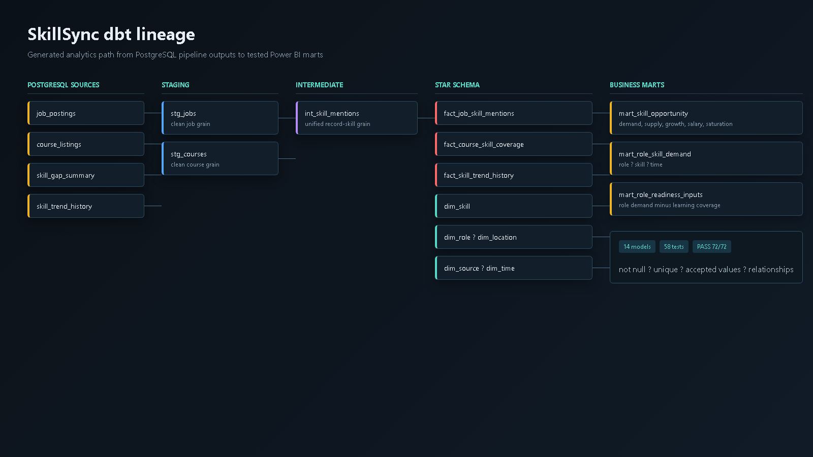
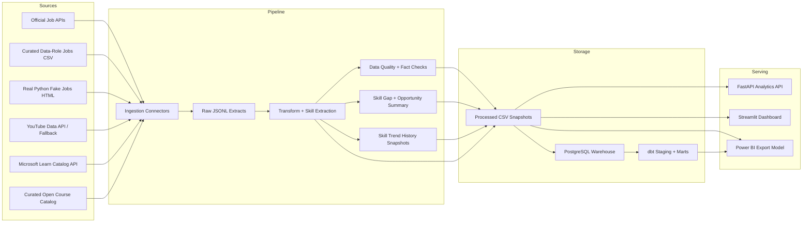

# SkillSync: Job Market Intelligence Dashboard

[](https://github.com/Sarthak2661/SkillSync/actions/workflows/ci.yml)


SkillSync is a job-market intelligence dashboard for people planning a data career. It compares hiring demand with available learning resources so users can see which skills are common requirements, which ones are growing, and which certifications or courses may be worth prioritizing.

Behind the dashboard is a Python ETL pipeline that collects job postings and learning resources, extracts skills from the text, validates data quality, stores historical snapshots, and serves the results through Streamlit, FastAPI, optional PostgreSQL tables, and Power BI-ready CSV exports.

See the [v1.5 release notes](docs/release-v1.5.md) for the current release scope and verification checklist.

## Purpose

People trying to enter data analyst, data engineering, or data science roles often see long lists of skills: SQL, Python, Power BI, Airflow, dbt, Snowflake, AWS, and many more. The hard part is not finding learning resources. The hard part is knowing which skills are actually showing up in job postings, whether enough learning material exists for those skills, and which certifications might be worth considering.

SkillSync turns that question into a small market-intelligence product:

- What skills are employers asking for?
- Which skills have enough courses or videos available?
- Which skills look under-supplied from a learning-resource perspective?
- How does demand change across repeated pipeline runs?
- What should a learner study or certify in next?

## How The Project Works

1. **Ingest**
   The pipeline collects job postings from public/sample job sources and learning resources from Microsoft Learn, YouTube/fallback records, vendor docs, open course catalogs, and university/open learning pages.

2. **Clean**
   Raw records are saved as JSONL, then normalized into analytics-ready job and course CSV files.

3. **Extract Skills**
   A rule-based skill extractor scans titles, descriptions, subjects, roles, and products for tools and skills such as Python, SQL, Power BI, Airflow, dbt, Snowflake, AWS, Azure, and machine learning.

4. **Score**
   The project calculates job demand, course supply, skill gap, demand/supply ratio, and a Skill Opportunity Index. Wage and growth inputs use O*NET occupation references when a skill maps cleanly to a data-related SOC occupation.

5. **Track History**
   Every run writes a `skill_trend_history` snapshot so the dashboard can show skill demand over time.

6. **Validate**
   Quality checks flag missing fields, duplicate records, stale postings, source-domain issues, salary anomalies, and rows where no skills were extracted.

7. **Serve**
   Outputs are available through Streamlit, FastAPI, PostgreSQL, and Power BI-ready CSV exports.

## Screenshots

### Overview


### Skill Trends


### Skill Explorer


### Learning And Certification Path


### Logs And Data Quality


### FastAPI Endpoints


### dbt Lineage




## Architecture



## What It Does

- Pulls job data from official job APIs, curated sample files, and optional parser-test pages.
- Pulls learning resources from Microsoft Learn, YouTube, and small maintained catalogs.
- Extracts skills such as Python, SQL, Power BI, Airflow, dbt, Snowflake, and AWS.
- Compares job demand with learning-resource supply.
- Grounds skill and wage signals in O*NET-SOC occupation mappings where possible.
- Lets users switch dashboard views between demo-safe data, live sources only, curated market snapshot, and all sources.
- Labels every source with confidence metadata: `live_verified`, `live_broad`, `curated_demo`, `fallback_learning`, or `test_source`.
- Adds O*NET-SOC occupation codes, mapped occupations, wage medians, and outlook fields to the skill ranking table.
- Saves a history row for every pipeline run so trends can be tracked over time.
- Runs basic data quality checks.
- Recommends certifications for selected skills.
- Finds current good-first-issue and help-wanted work in active GitHub repositories tagged for a selected skill.
- Serves the processed data through Streamlit, FastAPI, PostgreSQL, and Power BI exports.

## Project Structure

```text
api/                  FastAPI app
dashboard/            Streamlit dashboard
dbt/                  PostgreSQL staging, intermediate, dimensions, facts, marts, and tests
powerbi/              Power BI model and dashboard handoff
docs/                 Project notes, source notes, runbook, roadmap, screenshots
scripts/              Small local run/check scripts
src/analytics/        API and Power BI analytical model helpers
src/config/           Environment-based settings
src/etl/              File IO and transformations
src/ingestion/        Source connectors
src/quality/          Data quality checks
src/warehouse/        PostgreSQL loader
pipeline.py           One-time ETL run
scheduler.py          Recurring ETL scheduler
export_powerbi.py     Power BI CSV model export
docker-compose.yml    PostgreSQL, API, dashboard, pipeline, and dbt services
```

## Docker Quick Start

Start Docker Desktop first, then run:

```powershell
docker compose up --build
```

That starts:

- PostgreSQL 17 at `localhost:5434`
- one bootstrap pipeline run that creates local data files and Power BI CSVs
- FastAPI at `http://127.0.0.1:8000/docs`
- Streamlit dashboard at `http://127.0.0.1:8501`

No manual database setup is required for the default demo. The API and dashboard wait until the first pipeline run has completed.

Optional API keys can be added through your shell or `.env` before starting Docker:

```text
MARKET_INTEL_ADZUNA_APP_ID=
MARKET_INTEL_ADZUNA_APP_KEY=
MARKET_INTEL_YOUTUBE_API_KEY=
```

Stop the stack with:

```powershell
docker compose down
```
## Local Setup

Clone the repository and open it in VS Code:

```powershell
git clone https://github.com/Sarthak2661/SkillSync.git
cd SkillSync
code .
```

Create a virtual environment and install the dependencies:

```powershell
py -3.13 -m venv .venv
.\.venv\Scripts\Activate.ps1
python -m pip install -r requirements.txt
copy .env.example .env
```

Run the pipeline once:

```powershell
python pipeline.py
```

Export the Power BI CSV model:

```powershell
python export_powerbi.py
```

Run a quick check that the latest output is readable:

```powershell
python scripts\smoke_check.py
```

Start the dashboard:

```powershell
.\scripts\run_dashboard.ps1
```

Open `http://127.0.0.1:8501/`.

Start the API in a second terminal:

```powershell
.\scripts\run_api.ps1
```

Open `http://127.0.0.1:8000/docs`.

If PowerShell blocks scripts on your machine, use the `.cmd` files in `scripts/` instead.

## Optional PostgreSQL Loading

The project runs without PostgreSQL by default. To load pipeline outputs into a local PostgreSQL warehouse, update `.env`:

```text
MARKET_INTEL_LOAD_TO_POSTGRES=true
MARKET_INTEL_DB_URL=postgresql://postgres:<your-password>@localhost:5432/job_market_intel
```

Then run:

```powershell
python pipeline.py
```

The loader creates tables under the `market_intel` schema.

If you prefer Docker, start the included PostgreSQL service first:

```powershell
docker compose up -d postgres
```

The Docker database uses the credentials in `docker-compose.yml`.

## Source Modes

The default `.env.example` runs the full source mix. For a faster local demo, change these values in `.env`:

```text
MARKET_INTEL_JOB_SOURCE_MODE=curated
MARKET_INTEL_COURSE_SOURCE_MODE=hybrid
MARKET_INTEL_COURSE_SOURCE_LIMIT=50
```

Useful modes:

| Setting | Options |
| --- | --- |
| `MARKET_INTEL_JOB_SOURCE_MODE` | `curated`, `seed`, `adzuna`, `arbeitnow`, `remotive`, `job_apis`, `realpython`, `yc`, `all` |
| `MARKET_INTEL_COURSE_SOURCE_MODE` | `hybrid`, `open_catalog`, `vendor_docs`, `university_open`, `youtube`, `microsoft`, `microsoft_open`, `all` |

More detailed local run notes are in [docs/runbook.md](docs/runbook.md).

## Airflow Orchestration

The project includes a local Airflow DAG for a more realistic data-engineering workflow. `scheduler.py` remains as a simple fallback for users who do not want Docker orchestration.

```powershell
docker compose -f docker-compose.yml -f docker-compose.airflow.yml --profile airflow up --build
```

Open `http://localhost:8080`, log in with `admin` / `admin`, and trigger `skillsync_market_intel_pipeline`.

The DAG runs ingestion, transformation, quality checks, PostgreSQL loading, dbt models/tests, and Power BI export in dependency order.
## Scheduling

Use `scheduler.py` for repeated pipeline runs. The interval is controlled by `MARKET_INTEL_SCHEDULE_INTERVAL_MINUTES` in `.env`, and logs are written to `logs/scheduler.log`.

For production-style scheduling, run `pipeline.py` through Windows Task Scheduler, cron, or another scheduler of your choice.

## Testing

Run the test suite and smoke check before pushing changes:

```powershell
python -m unittest discover -s tests
python scripts\smoke_check.py
```

The tests cover ingestion, skill extraction, scoring, source confidence, O*NET evidence, data quality, and Power BI star-schema relationships.

## FastAPI

Start the API with:

```powershell
.\scripts\run_api.ps1
```

Open `http://127.0.0.1:8000/docs` for the interactive API documentation.

Main endpoints include `/health`, `/kpis`, `/skill-gaps`, `/skill-trends`, `/jobs`, `/courses`, `/certifications`, `/practice-projects`, `/quality`, and `/sources`.

## Streamlit Dashboard

Start the dashboard with:

```powershell
.\scripts\run_dashboard.ps1
```

Open `http://127.0.0.1:8501/`.

Dashboard pages include Overview, Trend Lab, Skills Explorer, Learning & Certification Path, Logs & Quality, and Guide.

## dbt Analytics Layer

The dbt project turns the pipeline tables into a tested star schema:

- Staging: stg_jobs and stg_courses.
- Intermediate: int_skill_mentions.
- Facts: job skill mentions, course skill coverage, and skill trend history.
- Dimensions: skill, role, location, source, and time.
- Marts: skill opportunity, role-skill demand, and role readiness inputs.

Run it against the Docker PostgreSQL warehouse:

    docker compose --profile analytics run --rm dbt build
    docker compose --profile analytics run --rm dbt docs generate
    docker compose --profile analytics run --rm -p 8081:8080 dbt docs serve --host 0.0.0.0 --port 8080

The validated build contains 14 models and 58 data tests covering nulls, uniqueness, accepted values, and relationships.

## Power BI Dashboard

Run `python export_powerbi.py`, then import the star-schema CSV files from `powerbi/export/` into Power BI Desktop.

Dashboard build instructions, relationships, and DAX measures are documented in [powerbi/README.md](powerbi/README.md).

## GitHub Practice Recommender

On the Learning & Certification Path page, select one skill to find open-source work in recently active repositories tagged with that GitHub topic. Results prefer good first issue, then help wanted, and exclude pull requests.

Public requests work without authentication. For a higher rate limit, add this to your local .env file:

    MARKET_INTEL_GITHUB_TOKEN=your_token_here

The token is optional, read only from the environment, and must not be committed. Responses are cached for 15 minutes. A live issue is a practice lead, not a guarantee that the task is still suitable or maintained.

## Data Quality Checks

The quality layer flags common issues before the dashboard is used, including low sample sizes, unexpected source domains, stale job postings, salary anomalies, duplicate records, and rows where no skills were extracted.

## Known Limitations

- YC Jobs and RealPython Fake Jobs are kept as optional legacy/parser sources. The preferred live job path is now official APIs because they are less fragile than HTML scraping.
- Live websites can change their HTML structure or access rules. The project includes sample/fallback sources so it can still run when a public source changes.
- YouTube uses the YouTube Data API only when `MARKET_INTEL_YOUTUBE_API_KEY` is configured; otherwise it uses local YouTube learning fallback records.
- PostgreSQL loading is optional and depends on Docker or a reachable local PostgreSQL database.
- GitHub issues can be closed or relabeled after retrieval, and unauthenticated API access has lower rate limits.

More notes are in:

- [docs/project_notes.md](docs/project_notes.md)
- [docs/source_notes.md](docs/source_notes.md)
- [docs/methodology.md](docs/methodology.md)
- [docs/runbook.md](docs/runbook.md)
- [docs/roadmap.md](docs/roadmap.md)

## Skill Opportunity Index

The main ranking metric is the Skill Opportunity Index:

```text
Skill Opportunity Index =
Demand Score
+ Growth Score, usually from O*NET occupation outlook
+ Salary Premium Score, usually from O*NET wage medians
- Course Supply Score
- Saturation Score
```

The output is scaled from 0 to 100:

```text
50
+ 0.35 * demand_score
+ 0.25 * growth_score
+ 0.25 * salary_premium_score
- 0.20 * course_supply_score
- 0.15 * saturation_score
```

Inputs:

- `demand_score`: calculated from job postings for the current run.
- `course_supply_score`: calculated from course listings for the current run.
- Salary premium score uses BLS median wages for mapped occupations, then posting salary ranges or a maintained fallback.
- Growth score uses numeric BLS employment projections for mapped occupations, then a maintained fallback.
- `saturation_score`: a rough signal for whether the skill is crowded or more of a basic requirement.

Labels:

- `High-value`: worth paying attention to.
- `Good bet`: useful and still has room in the market.
- `Balanced`: useful, but not clearly under-supplied.
- `Lower priority`: weaker demand, high saturation, or course-heavy.

The reason for this metric is simple: the most common skill is not always the best skill to learn next. A high-demand skill with plenty of courses may be less interesting than a growing skill with fewer learning resources.

## Skill Trend History

Every pipeline run writes a `skill_trend_history` snapshot with:

- `run_id`
- `run_timestamp`
- `source_name`
- `skill`
- `job_count`
- `course_count`
- `salary_min_avg`
- `salary_max_avg`
- `location`
- `role_category`

After multiple runs, the dashboard and API can answer trend questions such as:

- Python demand over time.
- SQL demand over time.
- Power BI vs Tableau demand.
- AWS vs Azure vs GCP cloud demand.
- GenAI, LLM, Responsible AI, or NLP skill growth.
- Airflow, dbt, Spark, and Databricks demand by role category.

The trend table is split by `location` and `role_category`, so Power BI can compare skill demand across markets and job tracks instead of showing one global count.

The pipeline also appends run metadata to `logs/pipeline_runs.csv`, including the run timestamp, record counts, trend-row count, and top opportunity skill. The dashboard's `Logs & Quality` page reads this file so scheduled refreshes can be audited.

## Learning And Certification Path

The dashboard also has a learning page:

- Recommended certifications by skill, provider, level, cost type, target role, and recommendation score.
- Related YouTube, Microsoft Learn, vendor-doc, university, and open-course resources.
- Market context for selected skills, including opportunity index, job demand, course supply, and target roles.

This page is meant to answer: "If this skill looks useful, what should I study or certify in next?"

## Reference data

The extraction taxonomy is project-defined. Exact technology matches are checked against O*NET Software Skills 30.3 and separated from broader occupation mappings. BLS supplies wage and employment-projection inputs. See [docs/methodology.md](docs/methodology.md) for definitions, limitations, source links, and attribution.

## Roadmap

Planned work is tracked in [docs/roadmap.md](docs/roadmap.md).
